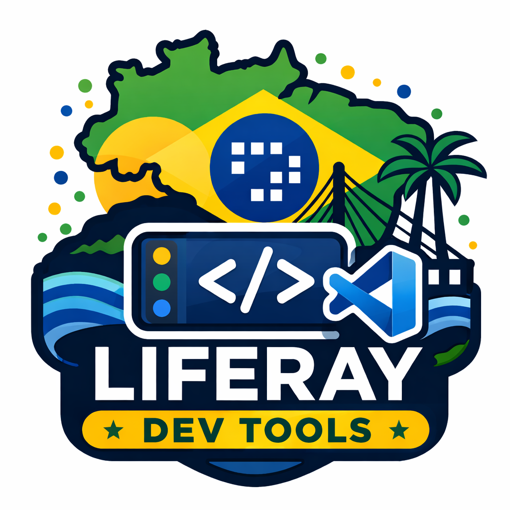

<p align="center">
  
</p>

# Liferay Dev Tools

Crie e gerencie workspaces Liferay 7.4 no VS Code com um fluxo guiado, usando `Gradle Wrapper` e sem precisar de Blade CLI ou Gradle instalado globalmente.

> Novo por aqui?
> Assista ao [tutorial em video](videos/tutorial.mp4) e siga o guia rapido abaixo para comecar.

## O Que Esta Extensao Faz

Esta extensao foi criada para simplificar o setup e o uso de projetos Liferay diretamente no Visual Studio Code, deixando o fluxo mais previsivel para quem quer criar workspace, baixar bundle, gerar client extensions e operar o portal sem sair da IDE.

Hoje, com a extensao, voce consegue:

- criar um novo Liferay Workspace
- escolher entre `Liferay DXP` e `Liferay Portal Community`
- selecionar a versao do produto
- gerar a estrutura padrao do workspace
- usar `Gradle Wrapper` embutido no workspace
- validar o Java antes da execucao
- executar `initBundle` sem Blade CLI
- criar client extensions a partir da pasta `client-extensions`
- abrir o workspace automaticamente no VS Code
- iniciar e parar o portal a partir de um painel visual

## Requisitos

Para usar a extensao, tenha somente estes pontos em mente:

- use `Java 11` ou superior
- nao e necessario instalar `Blade CLI`
- nao e necessario instalar `Gradle` globalmente
- a extensao executa as operacoes do portal com o `Gradle Wrapper` do workspace
- e necessario acesso a internet para baixar dependencias e bundles quando preciso

## Instalacao

1. Instale a extensao no VS Code.
2. Garanta que o `Java 11` ou superior esteja configurado na maquina.
3. Abra o Command Palette no VS Code.
4. Execute os comandos da extensao para criar e operar seu workspace.

## Tutorial em Video

Aprenda o fluxo principal da extensao, desde a criacao do workspace ate o uso dos comandos mais importantes:

<p align="center">
  
</p>

## Guia Rapido

### 1. Criar o workspace

Execute `Liferay: Create Workspace`.

Fluxo:

1. Escolha a edicao do produto
2. Escolha a versao
3. Informe o nome do workspace
4. Escolha a pasta de destino
5. A extensao gera os arquivos
6. O Java e validado
7. O `Gradle Wrapper` e testado
8. O workspace pode ser aberto automaticamente

### 2. Baixar o bundle

Abra o workspace criado e execute `Liferay: Download Bundle`.

Esse comando:

- valida o Java
- roda o Gradle em tempo real
- mostra progresso visual durante a execucao
- envia logs para o canal `Liferay Workspace`
- abre automaticamente o painel de controle do portal ao finalizar

### 3. Criar client extensions

Use `Liferay: Create Client Extension` ou clique com o botao direito sobre a pasta `client-extensions`.

Fluxos suportados:

- pelo Command Palette com escolha do tipo
- pelo clique direito em cima da pasta `client-extensions`
- submenu contextual com templates ja disponiveis

### 4. Gerenciar o portal

Use `Liferay: Manage Portal` para abrir o painel visual e controlar o portal do bundle baixado.

## Comandos Disponiveis

### `Liferay: Create Workspace`

Cria um novo workspace com:

- `gradlew` e `gradlew.bat`
- `gradle/wrapper`
- `settings.gradle`
- `gradle.properties`
- `.gitignore`
- pastas padrao do projeto

### `Liferay: Download Bundle`

Executa o `initBundle` no workspace aberto para baixar e preparar o bundle local.

### `Liferay: Create Client Extension`

Cria uma nova client extension dentro da pasta `client-extensions`.

Templates disponiveis no momento:

- `Custom Element`
- `Custom Element React Vite`
- `Custom Element Angular`
- `Site Initializer`
- `Batch`
- `ETC Cron`
- `ETC Node`
- `ETC Spring Boot`
- `Global CSS Company`
- `Global CSS Page`
- `Global JS Instance`
- `Global JS`
- `Global CSS`
- `IFrame`

Os templates ficam empacotados na propria extensao em `resources/client-extension-templates`.

### `Liferay: Manage Portal`

Abre um painel visual para controlar o portal do bundle baixado.

Esse painel:

- detecta o bundle em `bundles/`
- oferece acoes de `Start Portal` e `Stop Portal`
- mostra logs em tempo real
- exibe status, `PID` e ultimo erro conhecido

## Recursos Disponiveis Hoje

Estes sao os recursos ja disponiveis na extensao neste momento:

- criacao de workspace Liferay 7.4
- download de bundle com `initBundle`
- uso de `Gradle Wrapper` sem dependencia de Gradle global
- fluxo sem dependencia de Blade CLI
- criacao de client extensions por comando e menu contextual
- painel visual para iniciar e parar o portal
- acompanhamento de logs e status do portal

## Estrutura Gerada

```text
workspace
|- bundles
|- client-extensions
|- configs
|  |- common
|  \- local
|- modules
|- themes
|- wars
|- gradle
|  \- wrapper
|- gradlew
|- gradlew.bat
|- settings.gradle
|- gradle.properties
\- .gitignore
```

## Exemplo de `gradle.properties`

```properties
liferay.workspace.bundle.dist.include.metadata=true
liferay.workspace.modules.dir=modules
liferay.workspace.themes.dir=themes
liferay.workspace.wars.dir=modules
microsoft.translator.subscription.key=
liferay.workspace.product=portal-7.4-ga132
target.platform.index.sources=false
```

## Como Executar em Desenvolvimento

```bash
npm install
npm run compile
```

Depois:

1. abra o projeto no VS Code
2. pressione `F5`
3. uma nova janela de Extension Development Host sera aberta
4. execute os comandos da extensao pelo Command Palette

## Stack

- TypeScript
- VS Code Extension API
- Node.js `child_process`
- Gradle Wrapper
- Liferay Workspace Plugin

## Arquitetura

```text
src
|- commands
|  \- createWorkspace.ts
|- core
|  |- workspaceGenerator.ts
|  |- gradleRunner.ts
|  |- javaValidator.ts
|  \- versions.ts
|- utils
|  \- fs.ts
\- extension.ts
```

## Roadmap

Proximas funcionalidades planejadas:

- `Liferay: Create Module`
- `Liferay: Create Client Extension`
- `Liferay: Deploy Module`
- `Liferay: Start Portal`
- melhorias no painel de runtime do portal
- melhorias no progresso do download
- deteccao mais inteligente de caches e bundles locais

## Por Que Este Projeto Existe

Ferramentas de setup fazem diferenca no dia a dia. A proposta aqui e entregar uma experiencia mais moderna para desenvolvedores Liferay dentro do VS Code, reduzindo friccao e deixando o ambiente pronto com menos passos.

Em outras palavras: menos configuracao manual, mais desenvolvimento.

## Status

Projeto em evolucao ativa.

Ja funciona para criacao de workspace, execucao do `initBundle`, criacao de client extensions e gerenciamento inicial do portal, com estrutura pronta para crescimento.

## Contribuicao

Ideias, melhorias e sugestoes sao muito bem-vindas. Se quiser evoluir este projeto, sinta-se a vontade para abrir issue, propor ajustes ou expandir os comandos existentes.
